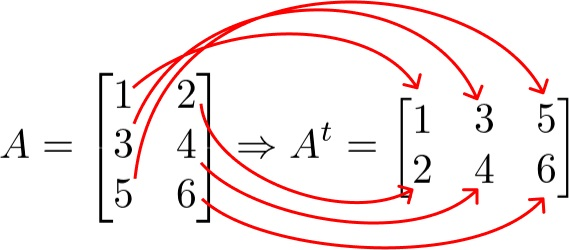

- Probabilidade
- Estatística
- Cálculo
- Álgebra linear

Base matemática:

- Mudança de base logaritmo

- Cardinal

pode ser denotada por n(A), |A| ou #A

Basicamente é o número de elementos de um conjunto

- Integral

- Função transposta X' 

obtida transportando-se ordenadamente os elementos das linhas de A para as colunas da transposta

(produto interno linha x coluna)

Fontes: 

https://www.youtube.com/watch?v=MSHpE9dnIho&list=PLyqOvdQmGdTTYHKdxWRmt8oOhMwYhmxkM
