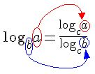

- Probabilidade
- Estatística
- Cálculo
- Álgebra linear

Base matemática:

- Mudança de base logaritmo

- # Cardinal

pode ser denotada por n(A), |A| ou #A

Basicamente é o número de elementos de um conjunto

Fontes: 

https://www.youtube.com/watch?v=MSHpE9dnIho&list=PLyqOvdQmGdTTYHKdxWRmt8oOhMwYhmxkM
