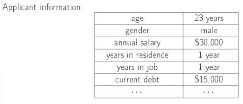

# Introdução

## Deferença AM x AI

- Exemplo: Crair um algoritmo para Previsão de Span

- Método tradicional
  - programação explicita de condições
  - if(numero de palavras < 100)
  - if(frequencia > 10/semana)
  - ...
  
- Aprendizagem de máquina
  - 100.000 descrições de exemplos não spam
  - 1000 descrições de exemplos spam
  - aprendizado a partir de exemplos
  
 
- Inteligˆencia artificial (IA)
  - Objetivo: fazer um computador aprender a realizar uma determinada tarefa que normalmente requer inteligência humana

- IA envolve
  - busca e planejamento
  - raciocinio e representa ̧c ̃ao do conhecimento
  - percepção
  - interações com o meio ambiente
  - processamento de linguagem natural
  - aprendizagem
  - . . .
  
- Aprendizagem de Máquina (AM)
  - Objetivo: fazer um computador aprender a realizar uma
determinada tarefa sem instruir explicitamente como faze-lo
  - o desempenho melhora

- AM ⊂ IA ⊂ CS (aprendizagem de máquina é um subconjunto da inteligência artificial e a inteligência artificial é um subconjunto da ciencia da computação)

## O problema do aprendizado

- Exemplo: Prever como um usuário avalia um filme
- A Netflix está premiando com 1 milhão de dólares para quem melhorar em 10%.
- A essência do aprendizado de máquina:
  - Existe um padrão
  - Não é possível contruir uma equação matemática
  - Existem dados disponíveis

(Aprendizagem de máquina é importante quanto você não tem idéia da relação entre as variáveis e da resposta)

Metáfora: Problema da Aprovação de crédito

- Aprovar crédito?
  - se for muito rigoroso vai ter pouca venda mas pouca inadiplência
  - se for rigoroso vai ter muita venda mas muita inadiplência
