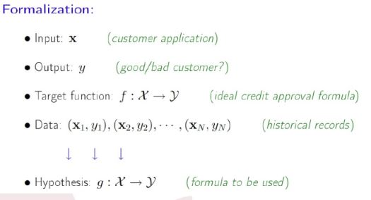
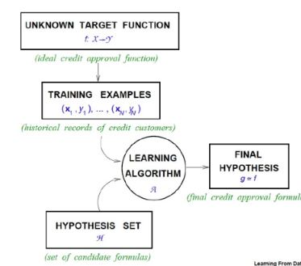
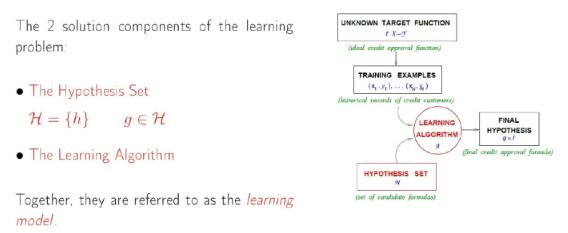

# Introdução

## Deferença AM x AI

- Exemplo: Crair um algoritmo para Previsão de Span

- Método tradicional
  - programação explicita de condições
  - if(numero de palavras < 100)
  - if(frequencia > 10/semana)
  - ...
  
- Aprendizagem de máquina
  - 100.000 descrições de exemplos não spam
  - 1000 descrições de exemplos spam
  - aprendizado a partir de exemplos
  
 
- Inteligˆencia artificial (IA)
  - Objetivo: fazer um computador aprender a realizar uma determinada tarefa que normalmente requer inteligência humana

- IA envolve
  - busca e planejamento
  - raciocinio e representa ̧c ̃ao do conhecimento
  - percepção
  - interações com o meio ambiente
  - processamento de linguagem natural
  - aprendizagem
  - . . .
  
- Aprendizagem de Máquina (AM)
  - Objetivo: fazer um computador aprender a realizar uma
determinada tarefa sem instruir explicitamente como faze-lo
  - o desempenho melhora


- AM ⊂ IA ⊂ CS (aprendizagem de máquina é um subconjunto da inteligência artificial e a inteligência artificial é um subconjunto da ciencia da computação)


## O problema do aprendizado

- Exemplo: Prever como um usuário avalia um filme
- A Netflix está premiando com 1 milhão de dólares para quem melhorar em 10%.
- A essência do aprendizado de máquina:
  - Existe um padrão
  - Não é possível contruir uma equação matemática
  - Existem dados disponíveis

(Aprendizagem de máquina é importante quanto você não tem idéia da relação entre as variáveis e da resposta)

Metáfora: Problema da Aprovação de crédito


- Aprovar crédito?
  - se for muito rigoroso vai ter pouca venda mas pouca inadiplência
  - se for rigoroso vai ter muita venda mas muita inadiplência

## Componentes do aprendizado







- Principal preocupação

  - Contrução de progrmas de computador que melhoram seu desempenho por meio de experiência
  
- Técnicas orientadas a dados

  - Aprendem automaticamente a partir de grandes volumes de dados.
  - Geração de hipóteses a partir dos dados
  

```
- Raciocínio indutivo - Parte dos exemplos que vai falhando...até deduzir algo

- Racioncínio dedutivo - Existe os axiomas apartir dele você vai deduz algo
```

## Exemplos

- AM tem sido utilizado rotineiramente para descobrir informações valiosas de grandes bases contendo: 

  - Registros de manutenção de equipamentos
  
  - Aplicações para empréstimos
  
  - Transações financeiras
  
  - Registros médicos
  
  - Genomas
  
## Aprendizagem de Máquina

- O que é aprendizagem ou eprendizado de máquina?
  
  - Arthur Samuel (1959): Aprendizagem de Máquina é o campo de estudo que dá ao computador a habilidade de aprender sem ser explicitamente programado
  
  - Tom Mitchell (1998): dizemos que um programa de computador aprende com a experiência E com relação a alguma classe de tarefas T e a medida de desempenho P, se seu desempenho nas tarefas em T, conforme medido por P, melhora com a experiência E. (Aprendizgem de máquina é o estudo de algoritmos de computadores que melhoram automaticamente atravéz da experiência).
  
Exemplo 1:

- Detecção de bons clientes para um cartão de crédito

  - Tarefa T: classificar potenciais novos clientes como bons ou maus pagadores.
  - Medida de Desempenho P: porcentagem de clientes classificados corretamente
  - Experiência de Treinamento E: uma base de dados histórica em que os clientes já conhecidos são previamente classificados como bons ou maus pagadores.
  
Exemplo 2:

- Reconhecimento de caracteres manuscritos

  - Tarefa T: reconhecer e classificar caracteres manuscritos
  - Medida de Desempenho P: percentagem de caracteres classificados corretamente
  - Experiência de Treinamento E: Base de dados de caracteres manuscritos com a respectiva classificação.
  
## Como aprendizagem de máquina funciona?


