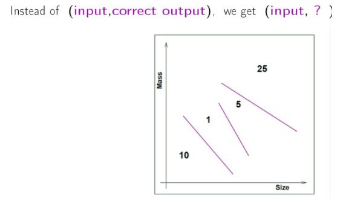
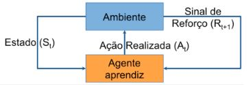

# Introdução

## Deferença AM x AI

- Exemplo: Crair um algoritmo para Previsão de Span

- Método tradicional
  - programação explicita de condições
  - if(numero de palavras < 100)
  - if(frequencia > 10/semana)
  - ...
  
- Aprendizagem de máquina
  - 100.000 descrições de exemplos não spam
  - 1000 descrições de exemplos spam
  - aprendizado a partir de exemplos
  
 
- Inteligˆencia artificial (IA)
  - Objetivo: fazer um computador aprender a realizar uma determinada tarefa que normalmente requer inteligência humana

- IA envolve
  - busca e planejamento
  - raciocinio e representa ̧c ̃ao do conhecimento
  - percepção
  - interações com o meio ambiente
  - processamento de linguagem natural
  - aprendizagem
  - . . .
  
- Aprendizagem de Máquina (AM)
  - Objetivo: fazer um computador aprender a realizar uma
determinada tarefa sem instruir explicitamente como faze-lo
  - o desempenho melhora


- AM ⊂ IA ⊂ CS (aprendizagem de máquina é um subconjunto da inteligência artificial e a inteligência artificial é um subconjunto da ciencia da computação)


## O problema do aprendizado

- Exemplo: Prever como um usuário avalia um filme
- A Netflix está premiando com 1 milhão de dólares para quem melhorar em 10%.
- A essência do aprendizado de máquina:
  - Existe um padrão
  - Não é possível contruir uma equação matemática
  - Existem dados disponíveis

(Aprendizagem de máquina é importante quanto você não tem idéia da relação entre as variáveis e da resposta)

Metáfora: Problema da Aprovação de crédito


- Aprovar crédito?
  - se for muito rigoroso vai ter pouca venda mas pouca inadiplência
  - se for rigoroso vai ter muita venda mas muita inadiplência

## Componentes do aprendizado


- Principal preocupação

  - Contrução de progrmas de computador que melhoram seu desempenho por meio de experiência
  
- Técnicas orientadas a dados

  - Aprendem automaticamente a partir de grandes volumes de dados.
  - Geração de hipóteses a partir dos dados
  

```
- Raciocínio indutivo - Parte dos exemplos que vai falhando...até deduzir algo

- Racioncínio dedutivo - Existe os axiomas apartir dele você vai deduz algo
```

## Exemplos

- AM tem sido utilizado rotineiramente para descobrir informações valiosas de grandes bases contendo: 

  - Registros de manutenção de equipamentos
  
  - Aplicações para empréstimos
  
  - Transações financeiras
  
  - Registros médicos
  
  - Genomas
  
## Aprendizagem de Máquina

- O que é aprendizagem ou eprendizado de máquina?
  
  - Arthur Samuel (1959): Aprendizagem de Máquina é o campo de estudo que dá ao computador a habilidade de aprender sem ser explicitamente programado
  
  - Tom Mitchell (1998): dizemos que um programa de computador aprende com a experiência E com relação a alguma classe de tarefas T e a medida de desempenho P, se seu desempenho nas tarefas em T, conforme medido por P, melhora com a experiência E. (Aprendizgem de máquina é o estudo de algoritmos de computadores que melhoram automaticamente atravéz da experiência).
  
Exemplo 1:

- Detecção de bons clientes para um cartão de crédito

  - Tarefa T: classificar potenciais novos clientes como bons ou maus pagadores.
  - Medida de Desempenho P: porcentagem de clientes classificados corretamente
  - Experiência de Treinamento E: uma base de dados histórica em que os clientes já conhecidos são previamente classificados como bons ou maus pagadores.
  
Exemplo 2:

- Reconhecimento de caracteres manuscritos

  - Tarefa T: reconhecer e classificar caracteres manuscritos
  - Medida de Desempenho P: percentagem de caracteres classificados corretamente
  - Experiência de Treinamento E: Base de dados de caracteres manuscritos com a respectiva classificação.
  
## Como aprendizagem de máquina funciona?


- Técnicas de AM

  - Ajustam seus parâmetros em uma **fase de treinamento**
    - Utiliza **conjunto** de dados de **treinamento**

  - Avaliam seu desempenho para novos dados em, uma **fase de teste** (ou validação)
    - Utiliza **conjunto** de dados de **teste**

  - Desempenho depende da representatividade dos exemplos
    - Aprendizado é mais confiável quando exemplos de treinamento seguem uma **distribuição** semelhante à dos **exemplos de teste**

### Aprendizagem de máquina para que? 

Causar um impacto positivo na sociedade! (não é pra prejudicar a sociedade ou criar uma máquina que vai matar todo mundo)

- Tarefas difíceis de especificar, porém **possíveis de se aprender a partir de exemplos**, como humanos fazem.

- Categorias de problemas tipicamente tratados por AM:


## Paradigmas de aprendizagem de máquina:

- Aprendizagem Supervisionada

- Aprendizagem Não Supervisionada

- Aprendizagem por Reforço

### Aprendizagem Supervisionada

- Tem como objetivo inferir uma função de mapeamento a partir de um conjunto de dados de treino rotulados.

- São fornecidos: entradas e saída desejadas rotuladas por um "Professor".


- O algoritmo de aprendizado (indutor) recebe um conjunto de exemplos de treinamento para os quais os rótulos da classe associada são conhecidos

- Cada exemplo (instância ou padrão) é descrito por um vetor de valores (atributos) e pelo rótulo da classe associada.

- O objetivo do indutor é construir um classificador que possa determinar corretamente a classe de novos exemplos ainda não rotulados

- Para rótulos de classe discretos, esse problema é chamado de classificação e para valores contínuos como regressão.

Exemplo: Reconhecimento de moedas


### Aprendizagem Não-Supervisionada

- Tem como objetivo inferir uma função para descrever uma estrutura a partir de dados não-rotulados.

- São fornecidas apenas as entradas e não há um professor ou supervisor para acompanhar o processo de aprendizado.


- O indutor analisa os exemplos fornecidos e tena determinar se alguns deles podem ser agrupados de alguma maneira, formando agrupamento ou clusters.

- Após a determinação dos agrupamentos, em geral, é necessário uma análise para determinar o que cada agrupamento significa no constexto problema sendo analisado.





- Aprendizado Semi-supervisionado

- Aprendizado por Reforço

- Aprendizado Online e Em Loto

- Aprendizado baseado em Instancia (preguiçoso) Versus Aprendizado baseado no Modelo (guloso)

### Aprendizagem Por Reforço

- Aprendizagem orientada ao agente, o qual aprende interagindo com o ambiente por tentativa e erro.

- Recebe um estado (S) de ambiente, realiza uma ação (A) e recebe como resposta um sinal de reforço (R) que apenas informa o quão bom/ruim foram as ações tomadas até aqui.



### Paradigmas de AM

- Simbólico

- Baseado em Instancias

- Estatístico

- Conexionista

- Evolucionário

#### Paradigma Simbólico

- Constrói representações simbólicas de um conceito através da análise de seus exemplos e contra-exemplos

- Representações simbólicas geralmente assumem a forma de:
  - Expressão lógica
  - Arvore de decisão
  - Regras de produção
  - Rede semantica
  
 #### Paradigma Baseado em Instancias
 
 - Classificam novos dados utilizando dados similares cuja classe é conhecida
 
 - Análogo ao que fazemos para resolver novos problemas
 
 - Exemplo: Raciocínio Baseado em Casos e K-vizinhos mais próximos.
 
 #### Paradigma Estatístico
 
 - Constrói um modelo estatítico do problema geralmente utilizando a **regra de Bayes**
 
 - Podem ser:
  - Paramétricas
  - Não paraméticas
  - Semi-paramétricas

#### Paradigma Evolucionário

- Computação Evolucionária (ou evolutiva)
  - Sistemas para a resolução de problemas que utilizam modelos computacionais baseados na teoria da evolução natural
  
  - Também chamados de algoritmos evolucionários
  
  - Inclui os **Algoritmos Genéticos**
 
#### Paradigma Conexionista

- Redes Neurais Artificiais
  - Estruturas distribuídas
    - Formadas por um grande número de unidades de processamento conectadas entre si
    
  - São pesquisadas em várias disciplinas:
    - Biologia, Ciencia da Computação, Engenharias, Estatística, Filosofia, Física, Linguística, Matemática, Psicologia,...


### Abordagens de aprendizagem

- Abordagens supervisionadas
  - Técnica centrada: Métodos de seleção de características, Probabilística métodos, árvores de decisão, métodos baseados em regras, baseados em instâncias aprendizado, classificadores SVM, redes neurais

  - Data-Type centrado: dados de grande escala (big data, data
fluxos), classificação de texto, classificação de multimídia, tempo
classificação de dados em série e sequência, dados de rede
classificação, classificação de dados de incerteza

  - Variações: aprendizado de classe rara, aprendizado de funções a distância, Aprendizagem conjunta, aprendizagem semi-supervisionada, aprendizagem por transferência, aprendizagem ativa, aprendizagem visual
  
  
 - Abordagens não supervisionadas
  - Técnica centrada: Métodos de seleção de características, Probabilística modelos, algoritmos baseados em distância, baseados em densidade e grade métodos, métodos de redução de dimensionalidade (generative modelos, fatoração de matrizes, co-agrupamento, métodos espectrais), Técnicas escaláveis (algoritmos de streaming, big data
estrutura)

  - Centrado no tipo de dados: dados categóricos, dados de texto, multimédia dados, dados temporais, sequências discretas, dados de rede, dados de incerteza 
  
  - Variações: agrupamento visual, insights supervisionados, multivisualização e agrupamento baseado em ensemble
  
 
## Aprendizagem Generativa x Discriminativa

- Aprendizagem discriminativa

  - Dependencia funcional entre a variavel resposta e as variaveis
descritivas

  - Desconsidera as rela ̧c ̃oes estatisticas entre a variavel resposta e
as variaveis descritivas

  - Modela diretamente a probabilidade a posteriori da variavel
resposta dado o vetor de atributos

- Aprendizagem Generativa

  - Considera as relações estatisticas entre a variavel resposta e as
variaveis descritivas

  - A probabilidade a posteriori da variavel resposta ́e obtida
atraves do terorema de Bayes via a probabilidade condicional
do vetor de atributos dado a varivel resposta


## Desafios do Aprendizado de Máquina

- Quantidade Insuficiente de Dados de Treinamento
- Dados de Treinamento N ̃ao Representativos
- Dados de Baixa Qualidade
- Caracter ́ısticas Irrelevantes
- Sobreajustamento
- Subajustamento

# Conceitos e Definições

- Exemplo (caso, registor ou dado) é uma tupla de valores de atributos
  - Um paciente, dados médicos sobre uma determinada doença
 
- Atributo: descreve uma característica ou um aspecto de um exemplo
  - Normal: cor
  - Contínuo: peso
  
- Classe: atributo especial (aprendizado supervisionado), denominado rótulo ou classe.
  - Classificação: discreto ou nominal C1, C2,... Ck
  - Regressão: valores reais
  
## Escala Nominal ou Categórica

- Valores são símbolos distintos que servem apenas para rotular ou identificar
  - Atributo "Sexo": Masculino e Feminino
  - Atributo "Religião": Católica, Protestante, Budismo,...
  - Atributo "Partido Político": DEM, PT, PSDB,...
  
- Não existem relações entre valores nominais - ordenação ou distância
  - Não faz sentido o teste "Masculino > Feminino"
  
- Apenas testes de igualdade podem ser feitos
  - "Sexo" = Masculino
  
## Escala Ordinal

- Os valores podem ser ordenados ou ranqueados 
  - Toda subclasse pode ser comparada com uma outra em termos de uma relação da forma "maior que" ou "monor que"
    - Atrubuto "Temperatura": Quente > Morno > Frio (no entanto, não faz sentido "Quente + Frio" ou "2*Morno")
  
  - Distinção entre Nominal e Ordinal não é sempre clara
    - Atributo "Tempo": Ensolarado, Nublado, Chuvoso
    
## Escala Intervalar

  - Quantidades intervalares além de ordenadas, também possuem unidades constantes de medidas
    - Diferenças entre quaisquer dois pontos adjacentes em qualquer parte da escala são iguais
    
    - O ponto zero é arbitrário
      - Soma e produto não fazem sentido
      
    - As escalas intervalares mais familiares são as escalas de temperatura Fahrenheit e Celsius
    
      - Cada uma tem um ponto zero arbitrário e nenhum indica uma quantia nula ou ausência de temperatura
        - Podemos dizer que 80F tem o dobro de temperatura de 40F?
        
## Escala de Razão

- Defere da escala intervalar por possuir um zero absoluto

  - Todas as operações matemáticas são possíveis com medidas em escala de razão
    - Números rais
    
   - Atributo "Distância": a distância entre um objeto e ele mesmo é zero
   
   - Atributo "Peso": os aparelhos usados para medir peso têm um ponto zero absoluto
   
## Para que tipos específicos de atributos?

- Compreender os deferentes tipos de escalas de medidas é importante por duas razões:
  - O pesquisador deve identificar a escala de medida de cada atributo usado, de forma que dados não-métricos não sejam incorretamente usados como dados métricos e vice-versa.
    - "Partido Político" > PSB não faz sentido, enquanto que "Temperatura" > Frio ou "Peso" < 38 fazem
    
   - A escala de medida é crítica ao determinar que algoritmos de aprendizado de máquina são mais apropriados.
   
 ## Concaitos e Definições
 
 - Conjunto de exemplos: um conjunto de exemplo é composto por exemplos contendo valores de atributos bem como a classe associada.
 
 
 
 - Classificador ou Hipótese: dado um conjunto de exemplos de treinamento, um indutor gera como saída um classificador (também denominado hipótese ou descrição de conceito) de forma que, dado um novo exemplo, ele possa predizer com a maio precisão possível sua classe.
 
 - Ruído: é comum no mundo real, trabalhar com dados imperfeitos. Eles podem ser derivados do próprio processo que gerou os dados, do processo de aquisição de dados, do processo de transformação ou mesmo devido a classes rotuladas incorretamente (por exemplo, exemplos com os mesmos valores de atributos mas com classes diferentes).
 
 - Missing Values (Valores Perdidos): em geral, indicados por valores fora do escopo
    - Tipos: desconhecidos, não registrados, irrelevantes
    - Razões
      - Mau-funcionamento do equipamento
      - Mudanças na definição do experimento
      - Incapacidade de mesuração
      
  - Valores perdidos podem, de fato, significar alguma coisa
    - A maioria dos métodos de aprendizado não assumem isto
    - No entanto, este tipo de informação pode ser codificado como um valor adicional
    
  - Modo de aprendizado:
    - Não incremental (batch): sempre que todo o conjunto de treinamento deva estar presente para o aprendizado.
    - Incremental: O indutor apenas tenta atualizar a hipótese antiga sempre que novos exemplos são adicionados ao conjunto de treinamento.
    
  - Taxa de Erro de um classificador h:
  
    - Compara a classe verdadeira de cada exemplo com o rótulo atribuído pelo classificador induzido.
    
    
