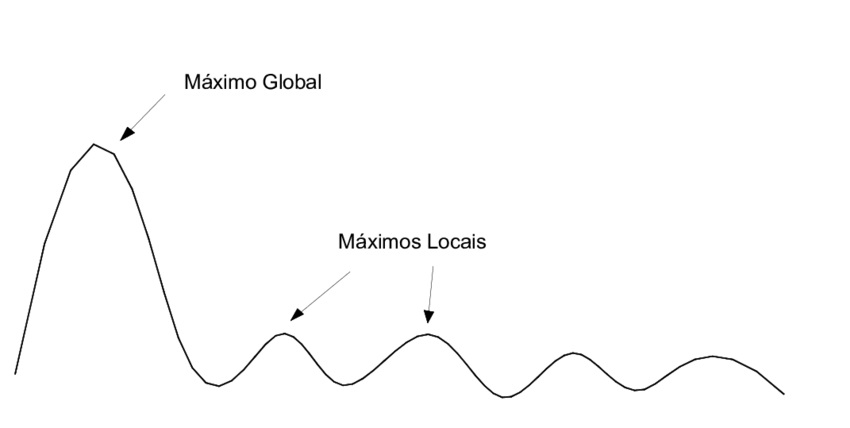

# IF699-APRENDIZAGEM-DE-MAQUINA

### Ementa
  - Fundamentos da aprendizagem de máquina
  - Tipos de aprendizado
  - Classificação e Regressão
  - Algoritmos de aprendizado supervisionado
  - Algoritmos de aprendizado n ̃ao-supervisionado
  - Avaliação de sistemas de aprendizado

- Árvore de Decisão

- k-NN

- Distâncias Heterogêneas

- Seleção de Protótipos

- DTW

- Seleção de Atributos

- Curva ROC

- Principal Component Analysis (PCA)

- Linear Discriminant Analysis (LDA)

- Avaliação de Hipóteses

Cursos na web
- Learning from Data
  - Yaser S. Abu-Mostafa
  - Caltech
  - https://work.caltech.edu/telecourse
- Machine Learning
  - Andrew Ng
  - Stanford
  - https://www.youtube.com/watch?v=PPLop4L2eGk&list=PLLssT5z_DsK-h9vYZkQkYNWcItqhlRJLN
- Data Mining and Machine Learning
  - Wagner Meira
  - UFMG
  - https://www.youtube.com/channel/UCUN8yMTrizS5GGaGnyj9y_g/featured
- Videos do Prof. Hansenclever (CIn/UFPE)
  - https://www.youtube.com/playlist?list=PL4-neXto5bGUpsE4FpO7T6BkLaSx_pyie

Bibliografia Básica

- Tom Mitchell. Machine Learning. McGraw-Hill, 1997.
- Richard O. Duda, Peter E. Hart and David G. Stork. Pattern Classification, Wiley-Intersicence, 2000.
- Christopher M. Bishop. Pattern Recognition and Machine Learning, Springer, 2006.

Bibliografia Complementar
- Ethem Alpaydin. Introduction to Machine Learning, The MIT Press, 2020.
- S. Theodoridis and K. Koutroumbas. Pattern Recognition, Academic Press, 2008.
- Yaser S. Abu-Mostafa, Malik Magdon-Ismail, Hsuan-Tien Lin. Learning From Data, AMLBook, 2012.
- Kevin P. Murphy. Machine Learning: A Probabilistic Perspective, The MIT Press, 2012
- Trevor Hastie, Robert Tibshirani, Jerome Friedman. The Elements of Statistical Learning: Data Mining, Inference, and Prediction. Springer, 2013.
- Ian Goodfellow and Yoshua Bengio and Aaron Courville. Deep Learning. MIT Press, 2016.http://www.deeplearningbook.org
- M. J. Saki and W. Meira. Data Mining and Machine Learning. Cambridge University Press, 2020.
- Braga, A., Carvalho, A.C.P.L.F. e Ludermir, T. Redes Neurais Artificiais: Teoria e Aplica ̧c ̃oes. LTC
- Facelli, K., Lorena, A.C., Gama, J., Carvalho, A.C.P.L.F. Inteligˆencia Artificial. Uma abordagem de Aprendizado de M ́aquina

https://sites.google.com/site/aprendizagemmaquina/aulas

===============
Formas não paramétrica

aprendizado preguiçoso
- possuem mais de um máximo local

probabilidade posteriori
k-vizinhos

LVQ - https://edisciplinas.usp.br/pluginfile.php/5389403/mod_resource/content/1/RNA_Aula11.pdf

===========================

O desempenho médio é sempre mais seguro que o desempenho individual (por isso uso o sistema de validação cruzada)

- Cada vez que você executa o código dá um resultado diferente. O ideal é você partir de um conjunto único (de treinamento, teste,validação). O train_test_split é importante partir de uma semente comum. (?)

=================
